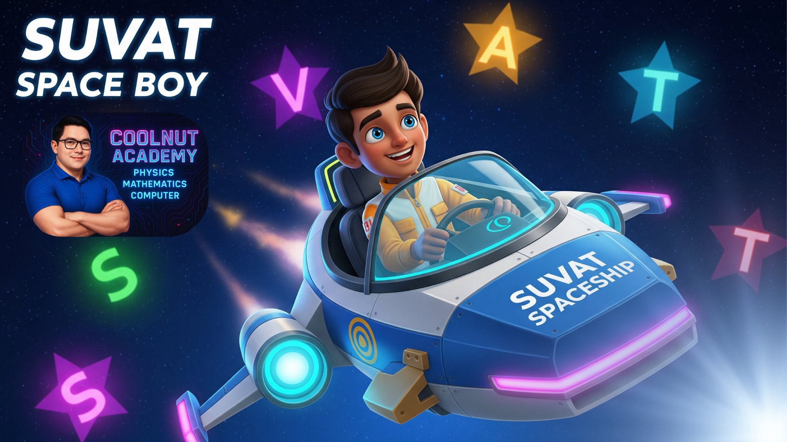

<p align="center">
  
</p>

<h1 align="center">🚀 SUVAT Space Boy</h1>

<p align="center">
  <strong>Interactive Physics Learning Game — Gamified SUVAT Equations of Motion</strong>
</p>

<p align="center">
  <a href="https://coolnut-academy.github.io/suvatspaceboy-game-01/">
    
  </a>
</p>

<p align="center">
  
  
  
  
  
  
</p>

---

## 📖 Overview

**SUVAT Space Boy** เป็นเกมการศึกษาเชิงโต้ตอบ (Interactive Educational Game) ที่ออกแบบมาเพื่อช่วยให้ผู้เรียนเข้าใจ **สมการการเคลื่อนที่แนวตรง (SUVAT Equations)** ผ่านประสบการณ์ Gamification ที่สนุกและมีส่วนร่วม พัฒนาโดย **Coolnut Academy** เพื่อยกระดับการเรียนรู้ฟิสิกส์ในระดับมัธยมศึกษา

> *"เปลี่ยนการท่องสูตรที่น่าเบื่อ ให้กลายเป็นการผจญภัยอวกาศที่น่าตื่นเต้น"*

---

## ✨ Key Features

| Feature | Description |
|---------|-------------|
| 🎮 **เกมผจญภัยอวกาศ** | ควบคุม Space Boy สำรวจอวกาศด้วย Joystick 8 ทิศทาง สะสมดาวตัวแปรเพื่อประกอบสูตร SUVAT |
| 📐 **สูตร SUVAT ครบ 5 สมการ** | ครอบคลุมสมการ v = u + at, s = ut + ½at², v² = u² + 2as, s = ½(u + v)t |
| 👾 **ระบบ Boss Battle** | ตอบคำถามฟิสิกส์แบบ MCQ และ Fill-in เพื่อเอาชนะบอสท้ายด่าน |
| 📊 **ระบบคะแนนและ Leaderboard** | ติดตามผลการเรียนรู้ จัดอันดับ Top 50 ด้วย Local Storage |
| 📖 **โหมดเรียนรู้** | ทบทวนสูตรพร้อมตัวอย่างการคำนวณจากสถานการณ์จริง |
| 🎯 **2 โหมดเล่น** | โหมดฝึกฝน (Practice) และโหมดทดสอบ (Test) พร้อมบันทึกข้อมูลผู้เรียน |
| 📱 **Responsive & PWA** | รองรับทุกขนาดหน้าจอ ติดตั้งเป็นแอปได้ เล่นออฟไลน์ได้ |
| 🔊 **ระบบเสียง** | เอฟเฟกต์เสียงตอบสนองต่อการกระทำ สร้างความสมจริงให้เกม |
| ✨ **Particle Effects** | อนุภาคเคลื่อนไหวเมื่อเก็บดาว สร้างแรงจูงใจในการเรียนรู้ |

---

## 🏗️ Tech Stack

### Core Technologies

| Technology | Usage |
|-----------|-------|
| **HTML5** | โครงสร้างหน้าเว็บ, Semantic Elements |
| **CSS3** | UI Styling, Animations, Responsive Layout |
| **JavaScript (ES6+)** | Game Logic, Application Controller, Event Handling |
| **HTML5 Canvas API** | 2D Game Rendering Engine — ตัวละคร, ดาว, พอร์ทัล, พื้นหลัง |

### Progressive Web App (PWA)

| Technology | Usage |
|-----------|-------|
| **Service Worker** | Cache-first Strategy สำหรับเล่นออฟไลน์ |
| **Web App Manifest** | ติดตั้งเป็น Standalone App บน Mobile/Desktop |

### Others

| Technology | Usage |
|-----------|-------|
| **Web Audio API** | Synthesize เสียงเอฟเฟกต์ในเกม (ไม่ต้องโหลดไฟล์เสียง) |
| **localStorage** | จัดเก็บข้อมูล Leaderboard (Top 50) |
| **Google Fonts (Kanit)** | ฟอนต์ภาษาไทยที่อ่านง่ายและสวยงาม |
| **GitHub Pages** | Static Hosting & Deployment |

---

## 📁 Project Structure

```
suvatspaceboy-game-01/
├── index.html            # Entry point — หน้าหลักของเกม
├── manifest.json         # PWA manifest configuration
├── sw.js                 # Service Worker (offline caching)
├── css/
│   └── style.css         # Global styles & responsive design
├── js/
│   ├── app.js            # Application controller (screens, state, events)
│   ├── game.js           # Game engine (canvas, player, stars, portal)
│   ├── boss.js           # Boss battle system (MCQ & fill-in questions)
│   ├── questions.js      # SUVAT question bank & solver logic
│   ├── audio.js          # Audio engine (Web Audio API synthesis)
│   ├── particles.js      # Particle effects system
│   └── leaderboard.js    # Leaderboard manager (localStorage)
└── assets/
    └── images/
        ├── cover.png     # Game cover art
        ├── player.png    # Player sprite
        └── background.png # Space background
```

---

## 🎯 Learning Objectives

เกมนี้ถูกออกแบบตามหลัก **SUVAT Equations of Motion** สำหรับการเคลื่อนที่แนวตรงด้วยความเร่งคงที่:

| สมการ | ตัวแปรที่ไม่ใช้ | คำอธิบาย |
|-------|---------------|---------|
| `v = u + at` | s | หาความเร็วสุดท้ายจากความเร็วต้น ความเร่ง และเวลา |
| `s = ut + ½at²` | v | หาระยะทางจากความเร็วต้น ความเร่ง และเวลา |
| `v² = u² + 2as` | t | หาความเร็วสุดท้ายโดยไม่ต้องทราบเวลา |
| `s = ½(u + v)t` | a | หาระยะทางจากความเร็วต้น ความเร็วสุดท้าย และเวลา |

**ตัวแปร:** `s` = ระยะทาง, `u` = ความเร็วต้น, `v` = ความเร็วสุดท้าย, `a` = ความเร่ง, `t` = เวลา

---

## 📱 Target Audience

- 🎓 **นักเรียน ม.ต้น – ม.ปลาย** ที่กำลังเรียนฟิสิกส์พื้นฐาน
- 👩‍🏫 **ครูผู้สอน** ที่ต้องการสื่อการสอนแบบ Gamification
- 📚 **ผู้เรียนด้วยตนเอง** ที่ต้องการทบทวน SUVAT อย่างสนุก

---

## 🚀 Getting Started

### เล่นออนไลน์

👉 **[https://coolnut-academy.github.io/suvatspaceboy-game-01/](https://coolnut-academy.github.io/suvatspaceboy-game-01/)**

### รันในเครื่อง (Local Development)

```bash
# Clone repository
git clone https://github.com/coolnut-academy/suvatspaceboy-game-01.git

# เปิด index.html ด้วย Live Server หรือเว็บเบราว์เซอร์
# (แนะนำใช้ VS Code + Live Server extension สำหรับ development)
```

> **หมายเหตุ:** โปรเจกต์นี้เป็น Static Web App ไม่ต้องติดตั้ง dependencies ใดๆ เปิดไฟล์ `index.html` ได้ทันที

---

## 🎮 How to Play

1. **เลือกโหมด** — ฝึกฝน (เล่นอิสระ) หรือ ทดสอบ (กรอกข้อมูลผู้เรียน)
2. **สำรวจอวกาศ** — ใช้ Joystick บังคับ Space Boy เก็บดาวตัวแปรที่ตรงกับสูตร
3. **ประกอบสูตร** — เก็บตัวแปรครบแล้วเข้าพอร์ทัลเพื่อผ่านด่าน
4. **สู้กับบอส** — ตอบคำถามฟิสิกส์ SUVAT ให้ถูกต้องเพื่อเอาชนะ
5. **เลเวลอัป** — ยิ่งเล่นยิ่งท้าทาย ทดสอบความเข้าใจอย่างต่อเนื่อง

---

## 📄 License

This project is developed by **Coolnut Academy** for educational purposes.

---

<p align="center">
  Developed with 💜 by <strong>Coolnut Academy</strong><br/>
  <em>Empowering Physics Learning through Gamification</em>
</p>
